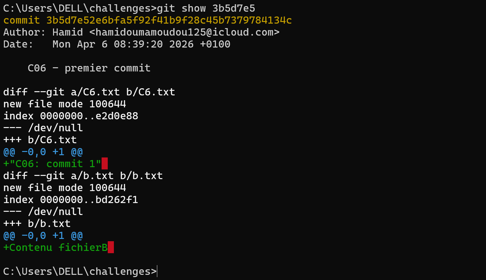
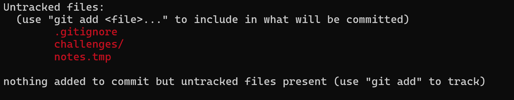
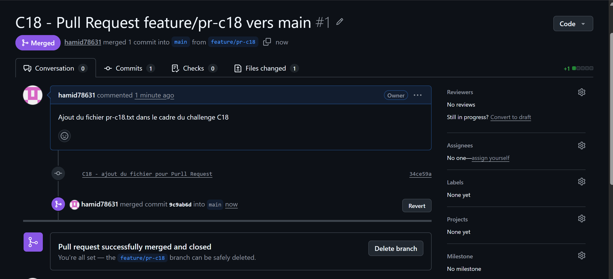

"# d�fis" 
## Objectifs : Apprendre Git pas a pas 

# Challenges Git & GitHub

## Description
Série de 20 challenges Git réalisés dans le cadre d'une formation,
couvrant les fondamentaux jusqu'aux workflows avancés.

## Compétences démontrées
- Gestion de l'historique (git log, git show)
- Branches et merges
- Résolution de conflits
- Git stash, squash, cherry-pick
- Tags et releases
- Pull Requests GitHub
- Utilisation responsable de l'IA avec Git

## Structure des branches
- `main` : branche principale stable
- `feature/about` : C09 - création de branche
- `feature/cherry-a` / `feature/cherry-b` : C15 - cherry-pick

## Historique
Tous les commits sont préfixés par le numéro de challenge (C01 à C20)
pour une traçabilité maximale.

CHALLENGE 6 : preuve du git show

CHALLENGE 8 : preuve du fichier ignoré avec git status
'travail en cours' 
"Tag ajout�"  

"C18 - Pull Request"
